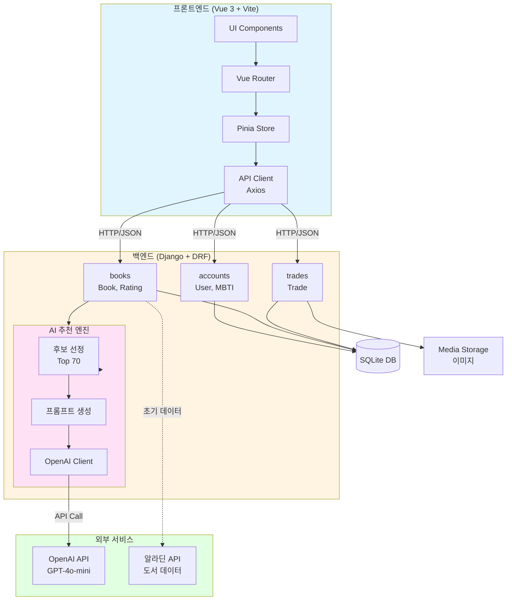
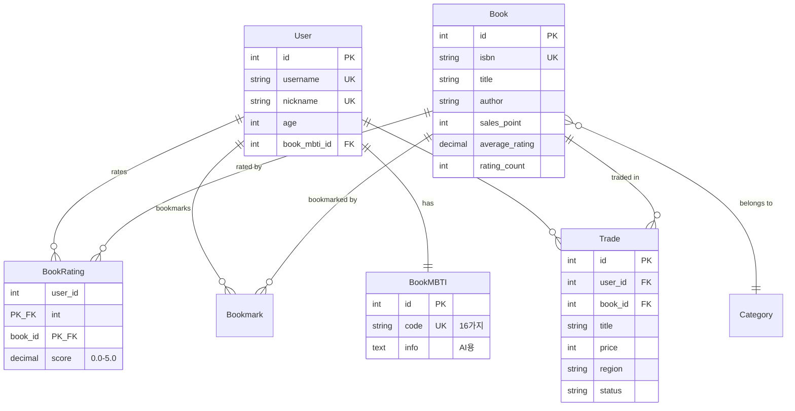

# 📚 동네책방 - AI 도서 추천 및 중고거래 플랫폼

> AI 기반 개인 맞춤형 도서 추천과 중고도서 거래를 통합한 온라인 도서 플랫폼

<p align="center">
  
  
  
  
</p>

---

## 📖 목차

- [프로젝트 소개](#-프로젝트-소개)
- [주요 기능](#-주요-기능)
- [기술 스택](#-기술-스택)
- [시스템 아키텍처](#-시스템-아키텍처)
- [프로젝트 구조](#-프로젝트-구조)
- [설치 및 실행](#-설치-및-실행)
- [API 문서](#-api-문서)
- [팀원 소개](#-팀원-소개)

---

## 🎯 프로젝트 소개

**동네책방**은 사용자의 독서 성향(도서 MBTI)을 분석하여 AI가 맞춤형 도서를 추천하고, 중고도서 거래까지 가능한 통합 플랫폼입니다.

### 프로젝트 배경

- 📊 개인화된 도서 추천 서비스의 필요성
- 💬 자연어 기반 대화형 추천 시스템의 부재
- 🔄 도서 구매와 중고거래 플랫폼의 분리로 인한 불편함

### 프로젝트 목표

1. **AI 기반 맞춤 추천**: GPT-4o-mini를 활용한 자연어 도서 추천
2. **도서 MBTI 시스템**: 16가지 독서 성향 분류로 개인화 강화
3. **통합 플랫폼**: 도서 검색부터 중고거래까지 원스톱 서비스

---

## ✨ 주요 기능

### 1. 🤖 AI 개인화 도서 추천

<table>
<tr>
<td width="50%">

#### 도서 MBTI 기반 추천

- 16가지 독서 성향 분류 (SFEP 조합)
  - **S/F**: Story(이야기형) vs Fact(정보형)
  - **R/I**: Realistic(현실) vs Imaginary(상상)
  - **E/D**: Easy(쉬움) vs Deep(깊음)
  - **P/C**: Pace(빠름) vs Chunk(느림)

</td>
<td width="50%">

#### AI 추천 엔진

- 사용자 MBTI + 자연어 요청 분석
- 70권 후보 자동 선정 (스코어링 알고리즘)
- GPT-4o-mini가 3권 최종 추천
- 할아버지 말투의 따뜻한 추천 문구

</td>
</tr>
</table>

**추천 알고리즘**:

```
1. 필터링: 카테고리 + 성인 도서 정책
2. 스코어 계산: popularity_score × trend_boost × review_boost
   - popularity_score = log₁₀₀₀₀₀(sales_point + 1)
   - trend_boost: 베스트셀러 순위 기반 (1.0x ~ 1.5x)
   - review_boost: 고객 리뷰 랭킹 기반 (1.0x ~ 1.3x)
3. Top 70 선정 → 랜덤 50권 → AI가 3권 추천
```

---

### 2. 📖 도서 검색 및 정보

- **베스트셀러 TOP 50** 조회
- **제목/저자** 검색 with 자동완성
- **카테고리 다중 필터** (소설, 에세이, 인문 등)
- **성인 도서 필터** (20세 이상)
- **도서 상세 정보**: 알라딘 API 데이터 + 평점 시스템

---

### 3. ⭐ 평점 & 북마크 시스템

- **평점 등록**: 0.0 ~ 5.0 별점 (사용자당 1회)
- **북마크**: 도서 찜하기 기능
- **자동 집계**: Signal을 통한 평균 평점 실시간 계산
- **프로필 연동**: 내 평점/북마크 목록 조회

---

### 4. 💰 중고도서 거래 플랫폼

<table>
<tr>
<td width="50%">

#### 거래글 작성

- 도서 검색 (자동완성)
- 판매 유형: 판매 / 무료나눔
- 지역 선택 (18개 시도)
- 이미지 업로드
- 카카오톡 오픈채팅 연동

</td>
<td width="50%">

#### 검색 및 필터

- 제목/내용/도서명/ISBN 검색
- 판매 유형 필터
- 거래 상태 필터 (판매중/예약중/완료)
- 지역 필터
- 가격 범위 필터
- 최신순/가격순 정렬

</td>
</tr>
</table>

---

## 🛠 기술 스택

### Frontend

| 분류            | 기술         | 버전   | 설명                         |
| --------------- | ------------ | ------ | ---------------------------- |
| **프레임워크**  | Vue.js       | 3.5.25 | Composition API 기반 SPA     |
| **상태관리**    | Pinia        | 3.0.4  | 경량 상태 관리               |
| **라우팅**      | Vue Router   | 4.6.3  | SPA 라우팅 + 네비게이션 가드 |
| **HTTP**        | Axios        | 1.13.2 | REST API 통신 + 인터셉터     |
| **스타일링**    | Tailwind CSS | 4.1.18 | 유틸리티 기반 CSS            |
| **UI 컴포넌트** | DaisyUI      | 5.5.14 | Tailwind 기반 컴포넌트       |
| **캐러셀**      | Swiper       | 12.0.3 | 이미지 슬라이더              |
| **빌드 도구**   | Vite         | 7.2.4  | 초고속 빌드                  |

### Backend

| 분류             | 기술                  | 버전   | 설명                      |
| ---------------- | --------------------- | ------ | ------------------------- |
| **프레임워크**   | Django                | 5.2.6  | 파이썬 웹 프레임워크      |
| **REST API**     | Django REST Framework | 3.16.1 | API 개발 프레임워크       |
| **인증**         | SimpleJWT             | 5.5.1  | JWT 토큰 인증             |
| **API 문서**     | drf-spectacular       | 0.29.0 | Swagger/OpenAPI 자동 생성 |
| **CORS**         | django-cors-headers   | 4.9.0  | CORS 정책 관리            |
| **이미지**       | Pillow                | 12.0.0 | 이미지 업로드 처리        |
| **AI**           | OpenAI                | 2.14.0 | GPT-4o-mini 연동          |
| **데이터베이스** | SQLite                | -      | 개발용 (MySQL 지원)       |

### External APIs

- **알라딘 오픈 API**: 도서 정보 수집 (500+ 도서)
- **OpenAI GPT-4o-mini**: AI 도서 추천 (SSAFY GMS 프록시)

---

## 🏗 시스템 아키텍처

### 전체 아키텍처



### ERD (Entity Relationship Diagram)



---

## 📁 프로젝트 구조

```
st_pjt/
├── frontend/                    # Vue 3 프론트엔드
│   ├── src/
│   │   ├── api/                 # API 클라이언트
│   │   │   ├── client.js        # Axios 인스턴스 (JWT 인터셉터)
│   │   │   ├── accounts.js      # 인증 API
│   │   │   ├── book.js          # 도서 API
│   │   │   └── trades.js        # 거래 API
│   │   ├── components/          # 공통 컴포넌트
│   │   │   ├── BookCard.vue
│   │   │   ├── TradeCard.vue
│   │   │   └── ToastNotification.vue
│   │   ├── layout/              # 레이아웃
│   │   │   ├── Layout.vue
│   │   │   └── components/
│   │   │       ├── Navbar.vue
│   │   │       └── BottomNav.vue
│   │   ├── router/              # Vue Router
│   │   │   └── index.js
│   │   ├── stores/              # Pinia 스토어
│   │   │   ├── loginStore.js
│   │   │   └── toastStore.js
│   │   ├── views/               # 페이지 컴포넌트
│   │   │   ├── home/            # 홈 페이지
│   │   │   ├── login/           # 로그인
│   │   │   ├── signup/          # 회원가입
│   │   │   ├── onboard/         # MBTI 온보딩
│   │   │   ├── book/            # 도서 검색
│   │   │   ├── book_detail/     # 도서 상세
│   │   │   ├── ai_recommend/    # AI 추천
│   │   │   ├── trade/           # 중고거래 목록
│   │   │   ├── trade_detail/    # 거래 상세
│   │   │   ├── trade_create/    # 거래 등록
│   │   │   ├── trade_edit/      # 거래 수정
│   │   │   └── profile/         # 프로필
│   │   ├── App.vue
│   │   └── main.js
│   ├── package.json
│   └── vite.config.js
│
├── backend/                     # Django 백엔드
│   ├── accounts/                # 사용자 인증 앱
│   │   ├── models.py            # User, BookMBTI
│   │   ├── serializers.py
│   │   ├── views.py
│   │   └── urls.py
│   ├── books/                   # 도서 관리 앱
│   │   ├── models.py            # Book, Rating, Bookmark, Category
│   │   ├── serializers.py
│   │   ├── views.py
│   │   ├── signals.py           # 평점 자동 계산
│   │   ├── services/            # 비즈니스 로직
│   │   │   ├── ai_client.py     # OpenAI 클라이언트
│   │   │   ├── ai_prompt.py     # 프롬프트 빌더
│   │   │   └── recommand.py     # 추천 후보 선정
│   │   └── urls.py
│   ├── trades/                  # 중고거래 앱
│   │   ├── models.py            # Trade
│   │   ├── serializers.py
│   │   ├── views.py
│   │   └── urls.py
│   ├── data/                    # 데이터 초기화
│   │   ├── fixtures/            # 초기 데이터 (JSON)
│   │   └── init_books.py        # 알라딘 API 크롤링
│   ├── bookmarket/              # 메인 프로젝트
│   │   ├── settings.py
│   │   ├── urls.py
│   │   └── wsgi.py
│   ├── media/                   # 업로드 이미지
│   ├── db.sqlite3               # SQLite DB
│   ├── requirements.txt
│   └── manage.py
│
├── README.md                    # 이 파일
└── 프로젝트_명세서.md            # 상세 명세서
```

---

## 🚀 설치 및 실행

### 사전 요구사항

- **Node.js**: v18 이상
- **Python**: 3.10 이상
- **Git**: 최신 버전

### 1. 저장소 클론

```bash
git clone https://github.com/your-repo/book-market.git
cd book-market
```

### 2. 백엔드 설정

```bash
cd backend

# 가상환경 생성 및 활성화 (Windows)
python -m venv venv
venv\Scripts\activate

# 의존성 설치
pip install -r requirements.txt

# 환경 변수 설정 (.env 파일 생성)
# OPENAI_API_KEY=your-api-key
# ALADIN_API_KEY=your-api-key

# 데이터베이스 마이그레이션
python manage.py makemigrations
python manage.py migrate

# 초기 데이터 로드 (카테고리, MBTI)
python manage.py loaddata data/fixtures/categories.json
python manage.py loaddata data/fixtures/book_mbti.json

# 알라딘 API로 도서 데이터 수집 (선택)
python manage.py init_books

# 개발 서버 실행
python manage.py runserver
```

백엔드 서버: `http://localhost:8000`

### 3. 프론트엔드 설정

```bash
cd frontend

# 의존성 설치
npm install

# 개발 서버 실행
npm run dev
```

프론트엔드 서버: `http://localhost:5173`

### 4. 접속

브라우저에서 `http://localhost:5173` 접속

---

## 📚 API 문서

### Swagger UI

백엔드 서버 실행 후 다음 URL에서 API 문서 확인:

```
http://localhost:8000/api/schema/swagger-ui/
```

### 주요 API 엔드포인트

#### 인증

- `POST /api/accounts/signup/` - 회원가입
- `POST /api/accounts/login/` - 로그인
- `POST /api/accounts/logout/` - 로그아웃
- `GET /api/accounts/profile/` - 프로필 조회
- `PATCH /api/accounts/profile/update/` - 프로필 수정

#### 도서

- `GET /api/books/` - 베스트셀러 TOP 10
- `GET /api/books/search/` - 도서 검색
- `GET /api/books/<id>/` - 도서 상세
- `POST /api/books/<id>/rating/` - 평점 등록
- `POST /api/books/<id>/bookmarks/` - 북마크 토글
- `POST /api/books/recommend/` - AI 추천 ⭐

#### 중고거래

- `GET /api/trades/` - 거래글 목록
- `GET /api/trades/search/` - 거래글 검색
- `POST /api/trades/create/<book_pk>/` - 거래글 등록
- `GET /api/trades/<id>/` - 거래글 상세
- `PATCH /api/trades/<id>/` - 거래글 수정
- `DELETE /api/trades/<id>/` - 거래글 삭제

자세한 내용은 [프로젝트\_명세서.md](./프로젝트_명세서.md#6-api-명세) 참조

---

## 🎨 주요 화면

### 홈 페이지

- 베스트셀러 TOP 10 캐러셀
- AI 추천 배너
- 최신 중고거래 글

### AI 추천 페이지

- 카테고리 다중 선택
- 자연어 요청사항 입력
- 할아버지 캐릭터 UI
- 추천 결과 3권 + 추천 이유

### 도서 상세 페이지

- 도서 정보 (표지, 제목, 저자, 출판사, ISBN, 가격, 소개)
- 평균 평점 및 평점 등록
- 북마크 버튼
- 해당 도서 중고거래 목록

### 중고거래 페이지

- 거래글 카드 그리드
- 다중 필터 (판매유형, 상태, 지역, 가격)
- 이미지 업로드
- 카카오톡 오픈채팅 연동

---

## 🔐 인증 시스템

### JWT 기반 토큰 인증

- **Access Token**: 1시간 만료
- **Refresh Token**: 7일 만료
- **자동 갱신**: Axios 인터셉터로 401 에러 시 자동 토큰 재발급
- **로컬 저장**: localStorage에 토큰 저장

### 라우터 가드

```javascript
// 인증 필요 페이지
requiresAuth: ['/profile', '/ai-recommend', '/trade/create', ...]

// 비로그인 전용 페이지
requiresGuest: ['/login', '/signup']

// MBTI 설정 강제
로그인 후 MBTI 미설정 시 /onboard로 자동 리다이렉트
```

---

## 🧪 테스트

### 백엔드 테스트

```bash
cd backend
python manage.py test
```

### 프론트엔드 빌드

```bash
cd frontend
npm run build
```

---

## 📈 주요 성과

### 기능적 성과

- ✅ **AI 추천 정확도**: 사용자 MBTI 기반 맞춤 추천
- ✅ **도서 데이터**: 500+ 권의 실제 알라딘 데이터
- ✅ **통합 플랫폼**: 검색 → 추천 → 평점 → 중고거래 원스톱

### 기술적 성과

- ⚡ **빠른 응답**: 일반 API 2초 이내, AI 추천 15초 이내
- 🔒 **보안**: JWT 토큰 + CORS 정책 + 비밀번호 해싱
- 📱 **반응형**: 모바일/태블릿/데스크톱 대응
- 🎨 **UX**: 다크모드 + 로딩 스켈레톤 + 토스트 알림

---

## 🚧 향후 개선 사항

### 단기 (1개월)

- [ ] 도서 리뷰 작성 기능
- [ ] 실시간 채팅 (중고거래)
- [ ] 추천 도서 히스토리 저장

### 중기 (3개월)

- [ ] 협업 필터링 추천 시스템 추가
- [ ] 푸시 알림 (거래 상태 변경)
- [ ] 결제 시스템 연동

### 장기 (6개월)

- [ ] 모바일 앱 (React Native)
- [ ] 도서관 API 연동 (대출 가능 여부)
- [ ] 독서 모임 커뮤니티 기능

---

## 👥 팀원 소개

| 이름       | 역할   | GitHub                                     | 담당 업무                   |
| ---------- | ------ | ------------------------------------------ | --------------------------- |
| **안지원** | 풀스택 | - | 프론트엔드 메인, 화면 구상 |
| **이승원** | 풀스택 | - | 백엔드 메인, API 제작   |
| **최인호** | 풀스택 | - | 백엔드 메인, AI 추천 로직 구현   |

---

## 📄 라이선스

이 프로젝트는 SSAFY 14기 1학기 프로젝트로 제작되었습니다.

---

## 🙏 감사의 말

- **알라딘**: 도서 정보 제공
- **OpenAI**: GPT-4o-mini API 제공
- **SSAFY**: GMS 프록시 서버 제공
- **Tailwind CSS & DaisyUI**: 아름다운 UI 컴포넌트

---

## 📞 문의

- **GitHub Issues**: [Issues 페이지](https://github.com/your-repo/book-market/issues)

---

<p align="center">
  Made with ❤️ by SSAFY 14th Team
</p>
